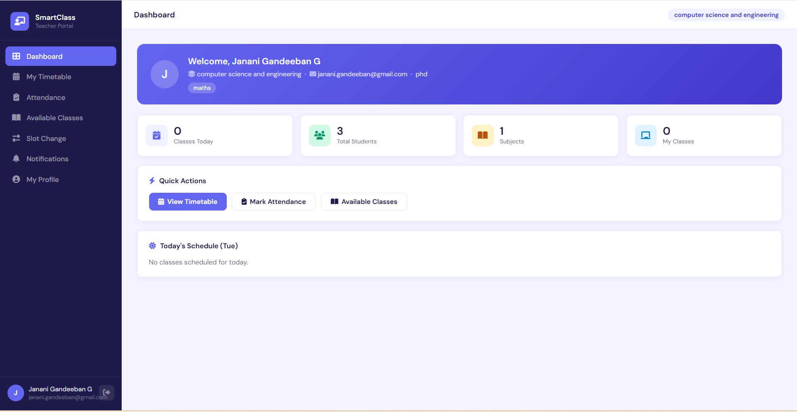
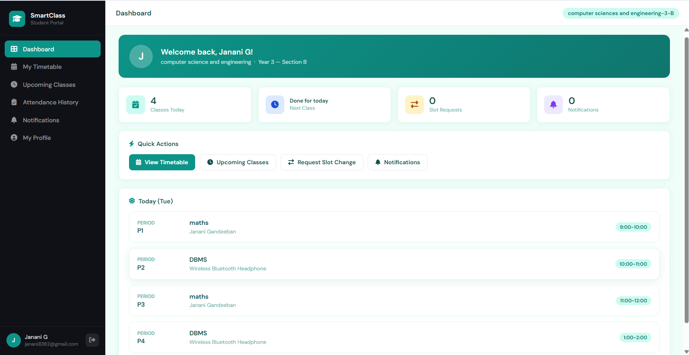
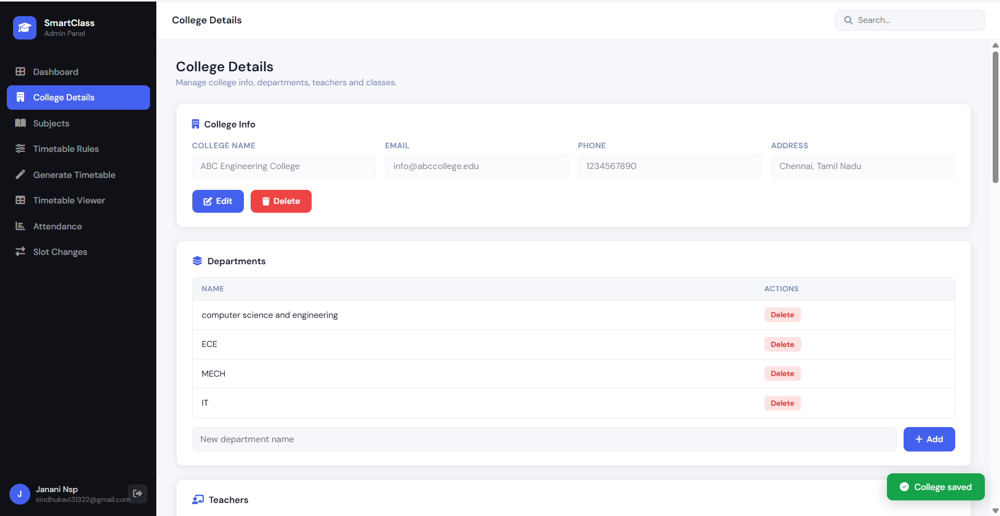
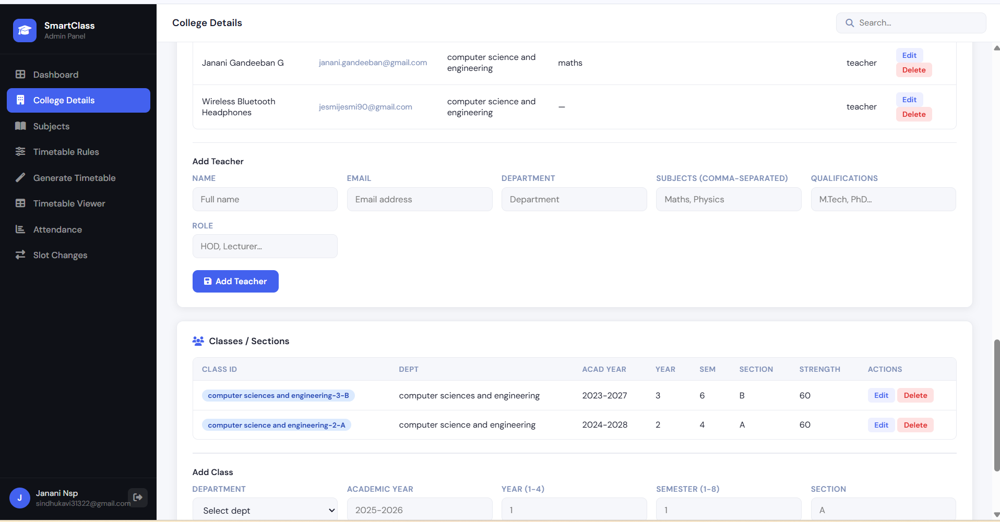
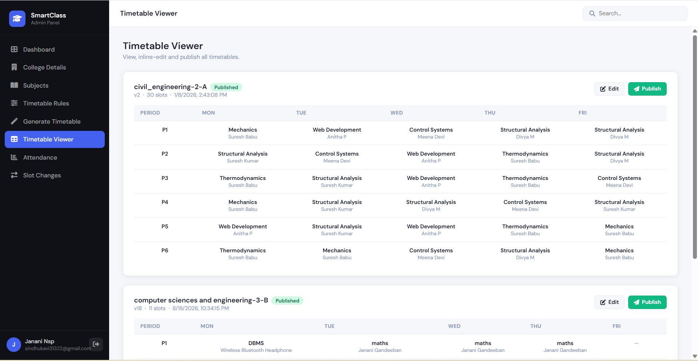
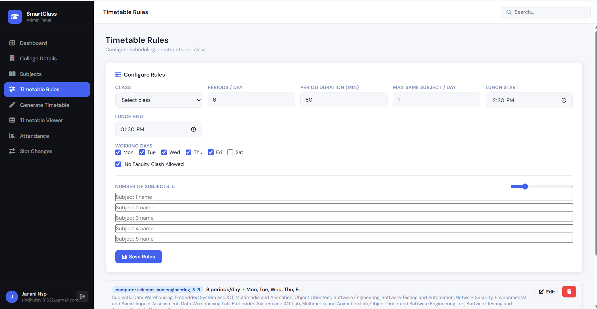

# 📚 Smart Classroom and Timetable Scheduler

A full-stack academic scheduling system designed to automate timetable generation, manage classroom resources, and provide real-time schedule updates for students and faculty.

The system consists of a **FastAPI backend**, a web-based frontend, and a dedicated notification service.

## ✨ Features

- 📅 **Automated Timetable Scheduling**
  - Generates conflict-free timetables.
  - Prevents teacher scheduling conflicts.
  - Prevents classroom/resource conflicts.

- 🏫 **Classroom Resource Management**
  - Manage classroom availability.
  - Track classroom and resource allocation.

- 👨‍🏫 **Faculty Management**
  - Manage faculty information and availability.
  - Prevent overlapping faculty schedules.

- 🔄 **Real-Time Updates**
  - Provides schedule updates and notifications through the notification service.

- 🔐 **REST API Backend**
  - FastAPI-based backend.
  - Modular API architecture.
  - Database integration using MongoDB.

- 📊 **Web Dashboard**
  - User-friendly interface for viewing schedules and managing academic information.
 
## 📸 Screenshots

### Teacher Dashboard


### Students Dashboard 


### College details in admin panel



### TimeTable



## 📂 Project Structure

```text
smart-classroom-and-timetable-scheduler/
│
├── backend/
│   ├── app/
│   │   ├── __init__.py
│   │   ├── database.py
│   │   ├── main.py
│   │   ├── models.py
│   │   └── routes.py
│   │
│   ├── .env
│   ├── requirements.txt
│   └── test_mongo.py
│
├── smart-classroom-frontend/
│   ├── Admin/
│   ├── css/
│   └── ...
│
├── notification-server/
│   └── ...
│
└── README.md
```

## 🛠️ Tech Stack

### Backend

- **Python**
- **FastAPI**
- **MongoDB**
- **REST APIs**

### Frontend

- **HTML5**
- **CSS3**
- **JavaScript**

### Development Tools

- **Git**
- **GitHub**
- **VS Code**

### Notification Service

- Dedicated notification server for delivering schedule updates and alerts.

## 🚀 Getting Started

### 1. Clone the Repository

```bash
git clone https://github.com/your-username/smart-classroom-and-timetable-scheduler.git

cd smart-classroom-and-timetable-scheduler
```

---

## 🔹 Backend Setup

Navigate to the backend directory:

```bash
cd backend
```

Install the required Python packages:

```bash
pip install -r requirements.txt
```

### Configure Environment Variables

Create a `.env` file inside the `backend/` directory:

```env
MONGO_URI=mongodb://localhost:27017/
MONGO_DB=smart_classroom_test
```

Make sure MongoDB is running before starting the backend.

### Start the FastAPI Server

```bash
uvicorn app.main:app --reload
```

The API will be available at:

```text
http://127.0.0.1:8000
```

---

## 🔹 Frontend Setup

Navigate to the frontend directory:

```bash
cd smart-classroom-frontend
```

If the frontend uses a Node.js development server:

```bash
npm install
npm start
```

Then open the local frontend URL provided by the development server.

---

## 🔹 Notification Server

Navigate to the notification service:

```bash
cd notification-server
```

Follow the service-specific configuration and startup instructions.

---

## 🧠 System Workflow

```text
                ┌──────────────────────┐
                │       Frontend       │
                │ HTML/CSS/JavaScript  │
                └──────────┬───────────┘
                           │
                           │ REST API
                           ▼
                ┌──────────────────────┐
                │    FastAPI Backend   │
                │   Python + FastAPI   │
                └──────────┬───────────┘
                           │
                    ┌──────┴──────┐
                    │             │
                    ▼             ▼
             ┌────────────┐  ┌──────────────┐
             │  MongoDB   │  │ Notification │
             │  Database  │  │   Server     │
             └────────────┘  └──────────────┘
```

The frontend communicates with the FastAPI backend through REST APIs. The backend handles scheduling logic, faculty/classroom management, and database operations. The notification service is responsible for delivering updates and alerts.

## 📌 Completed Project

The Smart Classroom and Timetable Scheduler has been completed as a modular academic scheduling system.

The project demonstrates:

- Backend API development
- Database integration
- Timetable scheduling logic
- Resource management
- REST API architecture
- Frontend-backend integration
- Real-time notification handling
- Modular application design

## 🔮 Future Improvements

Although the core project is completed, possible future enhancements include:

- 🤖 AI-based timetable optimization
- 📱 Mobile application
- 📊 Advanced analytics dashboard
- 🔔 More advanced notification preferences
- ☁️ Cloud deployment
- 👥 Role-based access control
- 📈 Scheduling performance analytics

## 🤝 Contributing

Contributions, suggestions, and improvements are welcome.

Feel free to open an issue or submit a pull request.

## 📄 License

This project is developed for educational and academic purposes.
